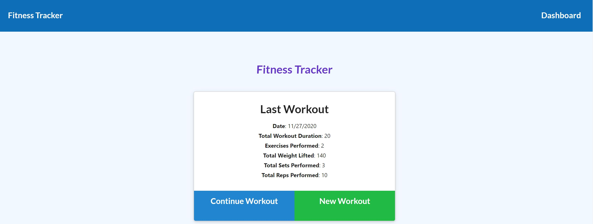
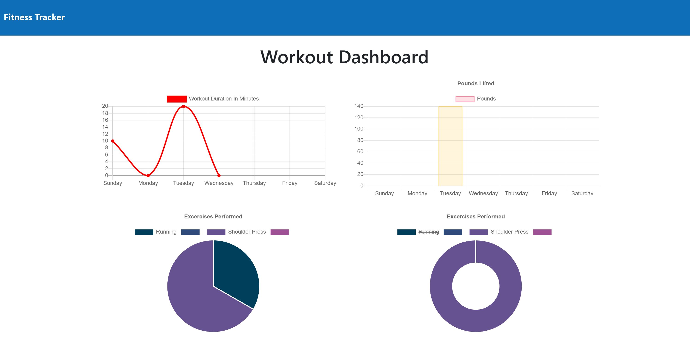

# Fitness Tracker

## Table of Contents
  - [Fitness Tracker](#fitness-tracker)
  - [Table of Contents](#table-of-contents)
  - [Description](#description)
  - [Installation](#local-installation)
  - [Business Context](#business-context)
  - [Demo](#demo)
  - [Contributors](#contributors)

## Description

For this assignment, I created a fitness tracker using a Mongo Atlas Database.

## Business Context

This application provides a simple solution to those who wish to keep track of their workouts.

## Tech/Modules Used :

### [MongoDB](https://www.mongodb.com/):
* MongoDB is a general purpose, document-based, distributed database built for modern application developers and for the cloud era.

### [Express](https://www.npmjs.com/package/expres)
* Express is a minimal and flexible Node.js web application framework that provides a robust set of features to develop web and mobile applications. It facilitates the rapid development of Node based Web applications.

### [Heroku](https://www.heroku.com/) : 
* Heroku is a platform as a service (PaaS) that enables developers to build, run, and operate applications entirely in the cloud.

### [Javascript](https://developer.mozilla.org/en-US/docs/Web/JavaScript) : 
* JavaScript is a cross-platform, object-oriented scripting language used to make webpages interactive.
* JavaScript(JS) is a lightweight, interpreted, or just-in-time compiled programming language with first-class functions. 
* With the HTML DOM, JavaScript can access and change all the elements of an HTML document.

### [Morgan Logger](https://www.npmjs.com/package/morgan) : 
* Morgan is a HTTP request logger middleware for Node. js. It simplifies the process of logging requests to your application. ... For example, Morgan can write requests in the Apache common format, split logs across outputs, and automatically rotate log files.

## Local Installation 

* Clone this repository to your local workstation.
* Run npm install to install dependencies required for this project.
* Run node server.js to start the application.

# Deployment
* https://bj-fitnesstracker.herokuapp.com/

## Screenshot  
| |

## Contributor
* Brandon Johnson
* Repository: https://github.com/sheikb08/Fitness-Tracker
